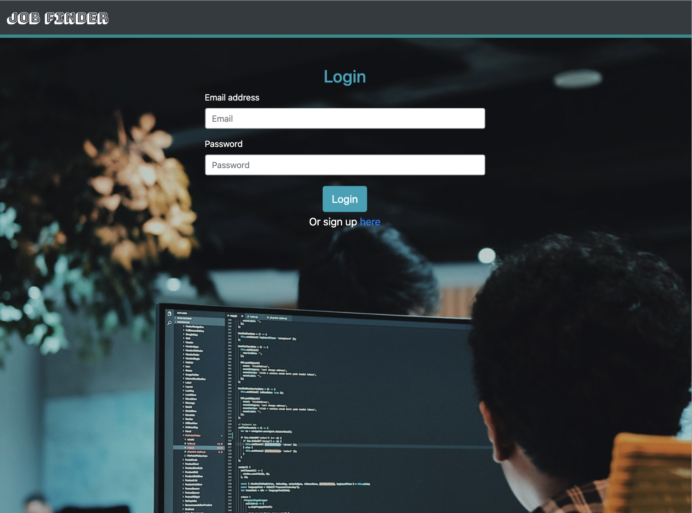
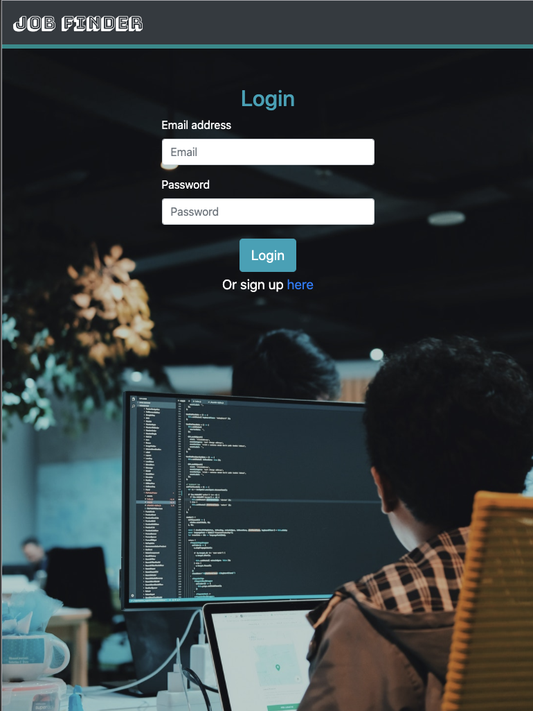
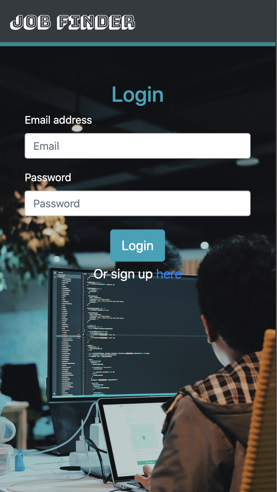

# Job Finder


# Project Description :

* This is a simple Job Finder application, where the user can first login or sign up (if a user does not have an account). 

* After login, User can search jobs by role, technologies, location or comapny. Also user can get all jobs,post a new job and view the jobs that are posted by logged in user. 

# Contributors:

* [Pratyusha Raghupatruni](https://github.com/PratyushaRaghupatruni)

* [Gauri Khandke](https://github.com/GauriKhandke)

* [Robeil Aregawi](https://github.com/Robeil)

* [Jason Kwong](https://github.com/saikitjk)

* [Baldeep Kang](https://github.com/kangb3) 


# Table of Contents

* [Demo](#demo)
* [Screenshots](#screenshots)
* [Technology](#technology)
* [Tools](#tools)
* [Features](#features)
* [License](#license)
* [Contribution](#contribution)


# Deployed Website: 

[Job Finder](https://uw-jobfinder.herokuapp.com/)

# Demo :


# Screenshots :

|Medium Devices/ Laptop|Small Devices/ Tablet|Extra Small Devices/Phone
|--|--|--
||| 

 # User Story

```
As a user, I should be able to login if I am a returning user.
As a user, I should be able to register using firstname, lastname and email, password if I am first time visitor.
As a user, I should be able to search for a job by technology, salary, location, and role.
As a user, I should be able to get all jobs listed.
As a user, I should be able to apply for Jobs.
As a user, I should be able to post a job.
As a user, I should be able to get jobs that I posted.
```

# Technology :

**1. [MySQL](https://www.npmjs.com/package/mysql2)** : 

* MySQL is an open-source relational database management system.

* A relational database organizes data into one or more data tables in which data types may be related to each other; these relations help structure the data.

**2. [Express.js](https://expressjs.com/)** :

* Web Applications : Express is a minimal and flexible Node.js web application framework that provides a robust set of features for web and mobile applications.

* APIs : With a myriad of HTTP utility methods and middleware, creating a robust API is quick and easy.

**3. [Node.js](https://nodejs.org/en/)** : 

* Node.js is an open-source and cross-platform JavaScript runtime environment. 

* A Node.js app is run in a single process, without creating a new thread for every request. 

**4. [Sequelize](https://www.npmjs.com/package/sequelize)** :

* Sequelize is a promise-based Node.js ORM for Postgres, MySQL, MariaDB, SQLite and Microsoft SQL Server. It features solid transaction support, relations, eager and lazy loading, read replication and more.

**5. [Handlebars.js](https://www.npmjs.com/package/handlebars)** :

* Fast execution: Handlebars compiles templates into JavaScript functions. This makes the template execution faster than most other template engines.

* Mustache-compatible: Handlebars is largely compatible with Mustache templates. In most cases it is possible to swap out Mustache with Handlebars and continue using your current templates.

**6. [Passport](https://www.npmjs.com/package/passport)** :

* Passport is Express-compatible authentication middleware for Node.js.

* Passport's sole purpose is to authenticate requests, which it does through an extensible set of plugins known as strategies. 

* The API is simple: you provide Passport a request to authenticate, and Passport provides hooks for controlling what occurs when authentication succeeds or fails.

**7. [Passport-local](https://www.npmjs.com/package/passport-local)** :

* Passport strategy for authenticating with a username and password.

* This module lets you authenticate using a username and password in your Node.js applications. By plugging into Passport, local authentication can be easily and unobtrusively integrated into any application or framework that supports Connect-style middleware, including Express.

**8. [bcryptjs](https://www.npmjs.com/package/handlebars)** :

* Hashes the password before storing into the database.

**9. [@handlebars/allow-prototype-access](https://www.npmjs.com/package/handlebars)** :

* This package allows you to create a new Handlebars instance, that behaves like version 4.5.3 and allows access to the prototype

**10. [express-session](https://www.npmjs.com/package/express-session)** :

* Create a session middleware with the given options.

* Session data is not saved in the cookie itself, just the session ID. Session data is stored server-side.

# Tools:

**[ES Lint](https://www.npmjs.com/package/eslint)** : 

* ESLint is a tool for identifying and reporting on patterns found in ECMAScript/JavaScript code.

**[Travis CI](https://travis-ci.org/)** :

* The simplest way to test and deploy projects.

* Easily sync your projects with Travis CI.

# Features :

1. User can sign up with firstname, lastmane, email and password if user is first time visitor.

2. After logging in with email and password, user can search for the job ,also apply for a job by clicking on the contact.

3. User can post a new Job and can also view the jobs he/she posted.

4. User can also get list of all jobs available by clicking on 'All Jobs'. 


# Future Development:

1. Ability to upload resume in order to get recognition by the recruiters.

2. Create user portfolio.

3. User could be able to delete the job he/she posted

4. Get the API key to fetch real time data and with the real time data ,redirect to a company website for applying for a Job.

# License

This project is licensed under MIT license.

# Contribution :
This app is licensed under the MIT licensing model. Feel free to fork the repo or clone it locally to your machine and make whatever changes you'd like.